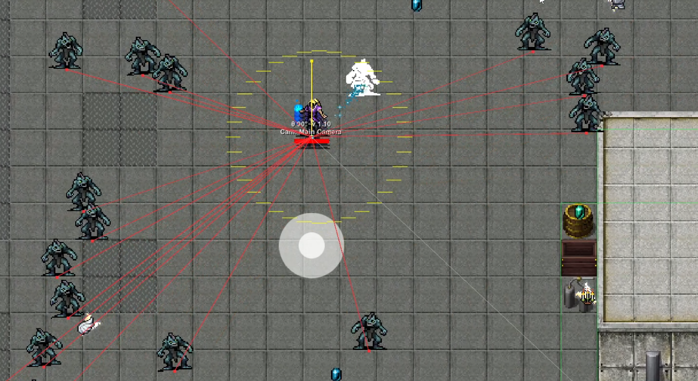

AI for Vampire Survivors

F6/F7 — toggle AutoEvade ON/OFF

F8 — toggle overlay

F9 — toggle sensors

F10 — cycle gameplay cameras (debug thingy for overlay alignment)

Currently breaks input after first run, oopsies.

